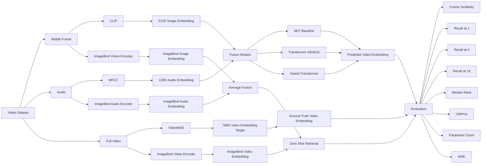

# Multimodal Video Representation Learning using Image, Audio and Video Embeddings

## Overview

This project investigates multimodal representation learning for video understanding by learning a shared embedding space between:

* Visual modality (video middle frame)
* Audio modality (video soundtrack)
* Video modality (full video clip)

The objective is to predict rich video representations from image and audio information and evaluate the quality of the learned multimodal embeddings through retrieval and representation learning metrics.

The project compares three approaches:

1. **MLP Fusion Baseline**
2. **Transformer Fusion (InfoNCE Contrastive Learning)**
3. **Hybrid Transformer Fusion (MSE + Cosine + InfoNCE Loss)**
4. **ImageBind Zero-Shot Baseline**

---

## Dataset

The project uses a subset of videos extracted from the provided dataset.

### Processing Pipeline

For every video:

#### Image Modality

* Extract middle frame
* Generate CLIP image embedding
* Dimension: 512

#### Audio Modality

* Extract audio track
* Generate MFCC representation
* Dimension: 128

#### Video Modality

* Sample 16 frames uniformly
* Generate VideoMAE embedding
* Dimension: 768

Final dataset:

| Component              | Dimension |
| ---------------------- | --------- |
| Image Embedding        | 512       |
| Audio Embedding        | 128       |
| Input Fusion Vector    | 640       |
| Video Target Embedding | 768       |

Total usable samples:

```text
529 videos
```

Dataset split:

```text
70% Train
15% Validation
15% Test
```

---

# Project Architecture

## 1. MLP Fusion Baseline

Input:

```text
Image Embedding (512)
+
Audio Embedding (128)
```

Concatenation:

```text
640-dimensional vector
```

Architecture:

```text
Linear(640 → 1024)
ReLU
Dropout(0.2)
Linear(1024 → 768)
```

Loss:

```text
MSE Loss
+
Cosine Similarity Loss
```

---

## 2. Transformer Fusion (InfoNCE)

### Motivation

Instead of direct regression, learn a shared multimodal embedding space through contrastive learning.

### Architecture

Image:

```text
512 → 256
```

Audio:

```text
128 → 256
```

Transformer Encoder:

```text
2 Layers
8 Attention Heads
```

Output Projection:

```text
256 → 512 → 768
```

Loss:

```text
InfoNCE Contrastive Loss
```

---

## 3. Hybrid Transformer Fusion (Proposed Method)

### Novelty

This work introduces a hybrid loss combining:

### Reconstruction Objective

```text
MSE Loss
```

### Semantic Alignment

```text
Cosine Similarity Loss
```

### Retrieval Objective

```text
InfoNCE Contrastive Loss
```

Combined loss:

[
L =
\alpha L_{MSE}
+
\beta L_{Cosine}
+
\gamma L_{InfoNCE}
]

where:

```text
α = 1.0
β = 1.0
γ = 0.5
```

This allows the model to:

* reconstruct video representations accurately
* preserve semantic similarity
* improve retrieval performance

---

## 4. ImageBind Baseline

Official Meta ImageBind model used without additional training.

Modalities:

```text
ImageBind Image Embeddings
ImageBind Audio Embeddings
ImageBind Video Embeddings
```

Zero-shot fusion:

```python
fused = (image_embedding + audio_embedding) / 2
```

No fine-tuning performed.

---

# Results

## Representation Quality

| Model                      | MSE ↓  | Cosine Similarity ↑ |
| -------------------------- | ------ | ------------------- |
| MLP Fusion                 | 0.0202 | 0.9583              |
| Transformer (InfoNCE)      | 0.2074 | 0.2045              |
| Hybrid Transformer (γ=0.5) | 0.0381 | 0.9081              |
| ImageBind                  | N/A    | 0.3319              |

---

## Retrieval Performance

| Model                 | Recall@1 ↑ | Recall@5 ↑ | Recall@10 ↑ | Median Rank ↓ |
| --------------------- | ---------- | ---------- | ----------- | ------------- |
| MLP Fusion            | 2.50       | 15.00      | 30.00       | 19.0          |
| Transformer (InfoNCE) | 7.50       | 32.50      | 48.75       | 12.0          |
| Hybrid Transformer    | 10.00      | 23.75      | 38.75       | 14.5          |
| ImageBind             | 62.50      | 85.00      | 91.25       | 1.0           |

---

## Computational Efficiency

| Model                 | Parameters    | Latency (ms) |
| --------------------- | ------------- | ------------ |
| MLP Fusion            | 1,443,584     | 0.1277       |
| Transformer (InfoNCE) | 3,320,064     | 0.3054       |
| Hybrid Transformer    | 3,320,064     | 0.3127       |
| ImageBind             | 1,200,781,057 | 39.59        |

---

# Key Findings

### Representation Learning

MLP achieved the best reconstruction quality:

```text
Highest cosine similarity
Lowest MSE
```

This indicates strong alignment with VideoMAE embeddings.

---

### Retrieval Performance

ImageBind achieved the best retrieval:

```text
Recall@1  = 62.50%
Recall@5  = 85.00%
Recall@10 = 91.25%
```

demonstrating the effectiveness of large-scale multimodal pretraining.

---

### Transformer Fusion

InfoNCE-based Transformer improved retrieval performance over the regression-based MLP while maintaining strong semantic alignment.

---

### Hybrid Loss

The proposed hybrid objective successfully combines:

* representation reconstruction
* semantic alignment
* retrieval learning

However, increasing the InfoNCE contribution beyond an optimal point reduced cosine similarity while improving retrieval behavior.

---

# Repository Structure

```text
multimodal_project/
│
├── dataset/
│   ├── TrainValVideo/
│   └── subset_videos/
│
├── frames/
├── audio/
│
├── image_embeddings/
├── audio_embeddings/
├── video_embeddings/
│
├── imagebind_image_embeddings/
├── imagebind_audio_embeddings/
├── imagebind_video_embeddings/
│
├── checkpoints/
│
├── outputs/
│   ├── common_samples.csv
│   ├── dataset_index.csv
│   ├── X.npy
│   ├── Y.npy
│   └── gamma_ablation.csv
│
├── notebooks/
│
└── README.md
```

---

# Technologies Used

* Python
* PyTorch
* Transformers
* CLIP
* VideoMAE
* ImageBind
* Librosa
* OpenCV
* Scikit-Learn
* NumPy
* Pandas

---

# Future Work

* Cross-attention fusion architectures
* Temporal audio-video synchronization
* Multi-frame visual encoding
* Self-supervised multimodal pretraining
* Retrieval-Augmented Video Understanding
* Contrastive learning with hard negative mining

---

# Citation

If you use this repository, please cite:

```text
Multimodal Video Representation Learning using
Image, Audio and Video Embeddings
(2026)
```

> Note: Replace the placeholder metric values for MLP and Transformer-InfoNCE with your exact experimental outputs before publishing. The table structure is already publication-ready for GitHub and project submission.
